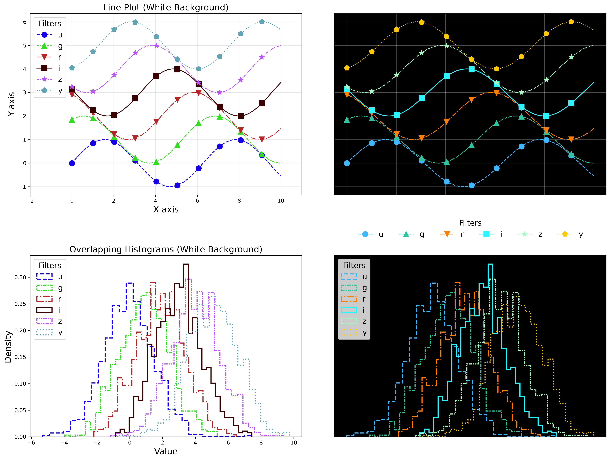

#############################
Guidelines for User Tutorials
#############################

.. abstract::

   This document defines the guidelines, principles, and formats for user-facing tutorials that demonstrate how to use
   the Rubin Science Platform (RSP) to analyze data from the Legacy Survey of Space and Time (LSST).
   All Rubin staff and the broader science community should use these guidelines when contributing to
   the sets of Jupyter Notebook or documentation-based tutorials maintained by the Rubin Community Science team (CST).

.. Metadata such as the title, authors, and description are set in metadata.yaml

.. TODO: Delete the note below before merging new content to the main branch.

.. Make in-text citations with: :cite:`bibkey`.
.. Uncomment to use citations
.. .. rubric:: References
..
.. .. bibliography:: local.bib lsstbib/books.bib lsstbib/lsst.bib lsstbib/lsst-dm.bib lsstbib/refs.bib lsstbib/refs_ads.bib
..    :style: lsst_aa

.. _pedagogical-principles:

Principles
==========

All tutorials should adhere to the following principles and to the `Rubin Developers Guide <https://developer.lsst.io/>`__.

**Inclusive.**
Follow the best practices described under :ref:`Accessibility considerations <accessibility-considerations>`.
Offensive or exclusionary language is never permitted (e.g., violent or ableist terms).
See the `Rubin Observatory Communications Code of Conduct <https://docushare.lsstcorp.org/docushare/dsweb/Get/Document-24920/>`_ for additional guidance.

**Clear.**
Write short, simple, unambiguous instructional statements in the `imperative mood <https://en.wikipedia.org/wiki/Imperative_mood>`_
by following the best practices described under :ref:`Narrative text <narrative-text>`.
Avoid jargon and define acronyms when they are first used.

**Focused.**
Limit the tutorial's content to only what is appropriate for the chosen `tutorial type <tutorial-types>`_ and what is necessary to meet the learning objective.
Tutorials should not take more than 30 minutes to complete.

**Consistent.**
Follow the formatting guidelines and use the templates for `Jupyter Notebooks`_ and `Documentation-based tutorials`_.

**Referenced.**
Provide the user with links to external resources (e.g., code package documentation, papers).
Mention any precursor (or advanced) tutorials that users can consider as prerequisite (or as follow-up).

**Credited.**
Individuals who contributed to the tutorial, or whose work was used as a basis or inspiration for the tutorial, must be acknowledged by name.
Include paper citations where possible.

.. _tutorial-types:

Tutorial types
==============

Every tutorial, whether a Jupyter Notebook or a documentation-based tutorial,
must choose a single type from the three options below,
be designed to fit into the tutorials' :ref:`organizational hierarchy <tutorial-types-org>`,
and follow the :ref:`naming convention <tutorial-types-names>`.

.. _tutorial-types-howto:

How-to: RSP functionality
-------------------------

Short tutorials with a learning objective of how to use a single RSP function or tool.

These tutorials are typically written without scientific context or motivation - just simple examples for quick reference.

Each "How-to" tutorial should take up to about 10 minutes to work through.

.. _tutorial-types-prod:

Data product definitions
------------------------

Tutorials with a learning objective of understanding one of the data products for a given release.

These tutorials each focus on one data product, e.g., one image type, one map type, or one catalog table.
They provide a description of the data and metadata, and demonstrate how to access the data product -- via multiple methods (e.g., TAP and butler) where applicable.

Descriptions of the data and metadata can be mainly qualitative (i.e., primary columns, recommended flags) but should include key quantities such as counts, sizes, volumes, coverage, etc.
These tutorials should link to the appropriate section of the data release documentation.

.. _tutorial-types-sci:

Science demonstrations
----------------------

Longer tutorials with a learning objective of executing an end-to-end scientific workflow.

These tutorials demonstrate data visualization techniques and scientific analyses that use multiple RSP tools and data products in sequence.
They should describe key scientific concepts and include scientific context and motivation for why the data and tools are used.

Each "Science demonstration" tutorial should not take more than about 30 minutes to work through.

.. _tutorial-types-org:

Organizational hierarchy
------------------------

Tutorials do not have defined learning levels or target audiences, but are arranged in a numbered, hierarchical system
where they appear to the user in order from introductory-level to more advanced.

The "100 level" are the `How-to: RSP functionality`_ tutorials.

 * The "101 series" are how-to tutorials on a given RSP functionality, such as Jupyter Notebooks or the Portal UI.
 * The "101.1 tutorial" would be a very simple, introductory-level how-to tutorial on Jupyter Notebooks or the Portal UI.
 * Subsequent "101.x tutorials" would illustrate more advanced use of the functionality.
 * Subsequent "10x series" would be for other functionality, like TAP, butler, Firefly, and so on.

The "200 level" are the `Data product definitions`_ tutorials.

 * The "201 series" would be for a data product type, such as catalog tables. 
 * The "201.1 tutorial" would be for the ``Object`` catalog.
 * Subsequent "201.x tutorials" would be for other tables, ``Source``, ``ForcedSource``, and so on.
 * Subsequent "20x series" would be for other data product types, like images and survey property maps.

The "300 level" are the `Science demonstrations`_ tutorials.

 * The "301 series" would be for a given astronomical field, such as cosmology or time-domain.
 * The "301.1 tutorial" would be an introductory-level demonstration within the astronomical field.
 * Subsequent "301.x tutorials" would be more advanced demonstrations of scientific analysis for the field.
 * Subsequent "30x series" would be for other astronomical fields.

**Why a "learning level" is not part of a tutorial's metadata:**
In the past (DP0-era), tutorials defined their learning level (target audience) as beginner, intermediate, or advanced.
This was not useful for two main reasons.
One, it is too challenging to be consistent in the application of qualitative user profiles (see `RTN-002 <https://rtn-002.lsst.io/>`_),
and two, the learning levels were only in the header or in the readme file and not easily seen by users.
For these reasons, the tutorials no longer have defined learning levels or target audiences,
and the ordering system described above has been adopted instead.

.. _tutorial-types-names:

Naming conventions
------------------

Tutorial names (filenames / titles) are the main way that users navigate the tutorial set.
While there will be a readme file with descriptions, it's best to assume no one will read it.

Thus, tutorials should have descriptive names that are as short as possible.
Yes, this seems like an oxymoron, and long names might be necessary at times.
A longer descriptive title is preferable to a shorter ambiguous title.

The names of tutorials in the 100 level should start with "How to", and
tutorials in the 200 level should be named simply by their data product.
Tutorials in the 300 level will be in sub-folders by astronomical field,
and so the names can focus on the analysis being demonstrated without
repeating the field.

.. _format-style-notebooks:

Jupyter Notebooks
=================

.. _format-style-notebooks-template:

Template
--------

Use the ``template.ipynb`` file in the ``rtn-045`` GitHub repository in the ``lsst`` GitHub Organization (`template notebook tutorial <https://github.com/lsst/rtn-045/blob/main/_static/template.ipynb>`_).

.. _format-style-notebooks-sections:

Section structure
-----------------

.. _format-style-notebooks-sections-header:

Header
^^^^^^

In the first markdown cell, set the title using heading level 1 (use a single ``#``).

Display the Rubin Observatory logo at upper left.
To the right of the logo list the RSP deployment,
the LSST Science Pipelines version,
the container size, the data release,
and the date last verified to run.

In the second markdown cell, write five short statements in the same cell, each on a new line.

 * **Learning objective:** A very brief description of notebook's learning objective.
 * **LSST data products:** List the catalogs and images used.
 * **Packages:** List the python packages that are relevant to the learning objective. For example, include ``afwDisplay`` and ``lsst.daf.butler`` for a notebook about retrieving and displaying images, but standard supporting packages like ``os``, ``glob``, or ``numpy`` usually don't need to be listed here.
 * **Credit:** Start with statements such as "Originally developed by..." or "Based on notebooks developed by..." and then people's names, including journal article or software release citations, as appropriate. Then add "Please consider acknowledging them if this notebook is used for the preparation of journal articles, software releases, or other notebooks."
 * **Get Support:** Use the following verbatim: "Everyone is encouraged to ask questions or raise issues in the `Support Category <https://community.lsst.org/c/support/6>`_ of the Rubin Community Forum. Rubin staff will respond to all questions posted there."

`Future work`_ includes being able to auto-generate a table of tutorial contents from notebook metadata and markdown cells, so it is important to follow the template.

.. _format-style-notebooks-sections-intro:

Introduction
^^^^^^^^^^^^

In the third markdown cell, name the first section "Introduction" using heading level 2: ``## 1. Introduction``.
Provide a brief narrative about this notebook's learning objective, e.g., "This notebook demonstrates...".
Cite or link to any external information or documentation.
Embed plots or images to help present key concepts.

**Related tutorials:** 
At the end of Introduction and before Section 1.1, if applicable,
mention any other relevant tutorials by name.
Do not link to them, because tutorials evolve continuously, there is no linkchecker for the notebook repo,
and tutorial hotlinks go stale quickly.
It is not necessary to mention the preceeding/subsequent tutorials in the same series as this one - those are trivial for the user to find.
But do use the "related tutorials" paragraph to mention tutorials in other series, or of other types.

**Import packages:**
The first subsection of the Introduction should always be ``### 1.1. Import packages``.
It should have a markdown cell that provides explanations and/or links to external package documentation, as appropriate.
All package imports must be done in the first code cell.

**Define parameters and functions:**
The second subsection should be ``### 1.2. Define parameters and functions``, if needed.
Globally defined utility functions, classes, plotting defaults, or constants should be here.
Instantiations of the TAP or butler services should also be done here.

Single-use functions or classes should instead be defined immediately before they are used
(it is more helpful for users to see code in context).
See the guidelines for functions and classes in the `Code cells`_ section below.

It is ok to rename (or remove) this section if no functions or parameters (or neither) need to be defined.
It is also ok to have sub-subsections, such as ``#### 1.2.1. Define global cosmological parameter values``
or ``#### 1.2.2. Define a function to make an image cutout``, if there are many to be defined.

Additional sections
^^^^^^^^^^^^^^^^^^^

Do not use title case for section headings; use sentence case.
(This Is Title Case. This is sentence case.)

All sections must be numbered to enable referencing in support requests, so that users can say,
e.g., "I'm having trouble with the second code cell in Section 2.3."

Use descriptive section titles, e.g., "2.2. Create a color-magnitude diagram" instead of "2.2. Plot",
so that the auto-generated table of contents is more useful.

The contents of the additional sections should alternate between :ref:`markdown cells <format-style-notebooks-markdown>`
with instructional statements written in the imperative mood (see the section on :ref:`narrative text <narrative-text>`),
and :ref:`code cells <format-style-notebooks-code>` to be executed by the user.

.. _format-style-notebooks-sections-exercises:

Exercises for the learner
^^^^^^^^^^^^^^^^^^^^^^^^^

It is very common, but not mandatory, to end all notebook tutorials with a section called
"Exercises for the learner".
This section should have specific tasks for users that will help them engage with the material.
For example, a task might suggest changing a parameter and re-running some code.

Do not include untested exercises.

Do not word the exercises as questions, but rather as instructions or tasks.

It is best if at least the first exercise includes a hint for the user to know if they've done it correctly.
For example, "try changing parameter X to be Y, then rerunning the notebook up to Section 3.2, and notice that Z is now 5".

.. _format-style-notebooks-pep8:

Use PEP8 and flake8
-------------------

``PEP8`` is the style guide for Python code that comprises the standard library of the distribution,
and ``flake8`` is a tool to ensure compliance with these standards.

Use ``flake8`` to ensure notebook code conforms to  `PEP 8 -- Style Guide for Python Code <https://www.python.org/dev/peps/pep-0008/>`_, with a few exceptions.

Notebook tutorial developers must install the following packages locally in their home directory:

::

  pip install --user flake8-nb
  pip install --user pycodestyle_magic
  pip install jupyterlab-spellchecker

Install the jupyterlab-spellchecker extension using the command provided above. After installation, log out and log back in to activate the extension.
When editing a markdown cell, Jupyterlab-spellchecker will highlight unknown words in red.

It is known that the most up-to-date version of ``flake8`` has some issues.
If errors are encountered such as ``AttributeError: '_io.StringIO' object has no attribute 'buffer'``,
force-downgrade ``flake8`` from version ``4.0.1`` to ``3.9.2`` with ``pip install flake8==3.9.2``.

**Create the flake8 config file:**
These instructions use ``emacs``, but it doesn’t matter so long as the end result is a
correctly-named file with the right contents.
Start in the home directory and execute the following.

::

  touch .config/flake8
  emacs .config/flake8

Then copy-paste the following into the opened config file.

::

  [flake8]
  max-line-length = 99
  ignore = E133, E226, E228, E266, N802, N803, N806, N812, N813, N815, N816, W503

Use ``x-s`` then ``x-c`` to save and exit emacs.

**While developing a notebook** have the following "magic" commands as the first code cell:

::

  %load_ext pycodestyle_magic
  %flake8_on
  import logging
  logging.getLogger("flake8").setLevel(logging.FATAL)

Whenever a cell is executed, it will use ``flake8`` to check for adherence to the ``PEP8`` coding style guide, 
and report violations which can be fixed immediately.
When the notebook is ready to be merged, the cell with the magic commands must be removed.

**When the notebook is complete** execute the following from the command line in the notebook's directory:

::

  flake8-nb notebook_name.ipynb

This will do a final check of any violations with ``PEP8``.
This will catch things that can be missed line-by-line, such as packages that are imported but never used.

.. _format-style-notebooks-markdown:

Markdown cells
--------------

Every code cell should be preceded with a markdown cell that contains instructional statements
written in the imperative mood (see the section on :ref:`narrative text <narrative-text>`).

Monospace font
^^^^^^^^^^^^^^

Any references to packages, variables used in code cells, or code commands should be in ``monospaced font``.

.. _format-style-notebooks-markdown-indented:

Indented text
^^^^^^^^^^^^^

Use indented text only for warnings (see `Known warnings`_) and figure captions. 

Indented text is created as in the following examples, which can also be found
in the :ref:`template notebook <format-style-notebooks-template>`.

::

  > **Warning:** the following cell produces a warning which is ok to ignore because...

::

  > **Figure 1:** Value 2 as a function of Value 1...

Embedded images
^^^^^^^^^^^^^^^

Use the drag-and-drop method to embed images in markdown cells.

Double click on the markdown cell and put the cursor at the desired line.
Drag-and-drop the image into the markdown cell.
A link of markdown code similar to what is shown will automatically appear.

::

  

Include a figure caption immediately after the embedded image, using `Indented text`_.
The figure should be numbered in the same series as generated :ref:`plots <format-style-notebooks-output-plots>`, and
the caption should include the citation to the source of the image.

Execute the markdown cell to see the image displayed.
An example embedded image is provided in the :ref:`template notebook <format-style-notebooks-template>`.

.. _format-style-notebooks-code:

Code cells
----------

All python code in Jupyter Notebooks should adhere to the
`Code Style Guidelines <https://developer.lsst.io/coding/intro.html>`_
in the `Rubin Developer's Guide <https://developer.lsst.io/>`_,
and should `Use PEP8 and flake8`_.

Comments
^^^^^^^^

Do not use comments (``#``) within a code cell as explanatory documentation.

Every code cell should be preceded by a :ref:`markdown cell <format-style-notebooks-markdown>`
that provides instruction and describes what the code does.
Code cells should be kept short enough that intra-cell comments are not necessary.

Only use comments within code cells to comment-out optional code.

Functions and classes
^^^^^^^^^^^^^^^^^^^^^

Functions and classes should be named following the
`Naming Conventions <https://developer.lsst.io/python/style.html#naming-conventions>`_
defined in the `Rubin Developer's Guide <https://developer.lsst.io/>`_.

Globally defined functions or classes which are used more than once in a notebook should be
defined in the :ref:`introduction <format-style-notebooks-sections-intro>`,
but single-use functions or classes can be defined immediately before they are used.

`Future work`_ includes creating a package of commonly-used functions in order
to avoid users encountering long blocks of code, and help keep notebooks readable.

Hidden cells
^^^^^^^^^^^^

No code cells should be hidden from the user.

In other words, do not use the "View" menu item and choose "Collapse Selected Code",
or click the blue bar that appears to the left of a selected cell, to hide long blocks of code.
The whole of the notebook should be visible to the user and the functionality of all
code cells should be described in preceding markdown cells.

TAP queries
^^^^^^^^^^^

TAP queries should always be run as asynchronous as this is the best practice and a good habit for users.

Asynchronous TAP queries should be followed up with an assert statement to confirm the job completed.
Including this assert statement will ensure notebooks that are run in full, either by users or mobu,
stop and return an appropriate error related to the job phase.

::

  rsp_tap = get_tap_service("tap")
  job = rsp_tap.submit_job(query)
  job.run()
  job.wait(phases=['COMPLETED', 'ERROR'])
  print('Job phase is', job.phase)
  assert job.phase == 'COMPLETED'

As the execution of TAP queries can be time-variable, the notebook's narrative text should not include
any estimates for how long the query should take, to avoid confusing or concerning the user.
The ``html`` files of executed versions of the notebooks (see `Converted notebooks`_) will show the 
execution time, should the user require an estimate.

Clearing memory
^^^^^^^^^^^^^^^

To reduce the memory footprint of a notebook, remove figures once they're no longer needed.
This is only necessary in notebooks that demonstrate data visualization with large datasets.

::

  def remove_figure(fig):
      """
      Remove a figure to reduce memory footprint.

      Parameters
      ----------
      fig: matplotlib.figure.Figure
          Figure to be removed.
        Returns

      -------
      None
      """
      for ax in fig.get_axes():
          for im in ax.get_images():
              im.remove()
      fig.clf()
      plt.close(fig)
      gc.collect()

Better ways to clear the memory are under consideration (see `Future work`_). 

Assert statements
^^^^^^^^^^^^^^^^^

Where essential, or where a very specific value is expected, the ``assert`` command can be used to
demonstrate to users that a condition is true.

For example, ``assert`` statements can be used to confirm that service objects like TAP are not
``None`` or ``null`` before moving on and using that instance,
or to check that values meet expectations (e.g., total rows returned from a query).

Do not use ``assert`` statements when, e.g., querying dynamic (prompt) datasets, which could return
different results and cause the assert statement to fail.

Consider more pedagogical alternatives when possible (e.g., printing schema columns would also fail if
the TAP service was not instantiated).

Known warnings
^^^^^^^^^^^^^^

If a code cell produces a warning which is known and is safe to ignore, add an indented statement
(see `Markdown cells`_) about the warning _before_ the code cell which produces the warning.

Do not use, e.g., ``warnings.simplefilter("ignore", category=UserWarning)``, because
ignoring categories of warnings can allow real issues to go unnoticed.

.. _format-style-notebooks-output:

Output
------

Tables
^^^^^^

Results from a Table Access Protocol (TAP) service search are best displayed as an
``astropy`` table using ``.to_table()``, or as a pandas dataframe using ``.to_table().to_pandas()``.

Do not use the ``.to_table().show_in_notebook()`` method.
This can cause issues in the RSP JupyterLab environment that cause the notebook to hang indefinitely.

.. _format-style-notebooks-output-plots:

Plots
^^^^^

**Size:**
Plots should be large enough such that the details in the data are easily discerned,
but small enough to fit within a small browser window (e.g., a laptop screen).
Typically, a statement such as ``fig = plt.figure(figsize=(6, 4))`` is sufficient (or ``(6, 6)`` for square plots).

**Labels:**
Axes labels with units are mandatory.
A legend must be included if multiple types of data are co-plotted.
A descriptive title is encouraged but not mandatory.

**Style:**
In general, the default ``matplotlib`` style is sufficient and should be adopted for plot attributes
such as line thickness, tick labels, fontsize, and so on.

**Colors:**
The default ``matplotlib`` color palette is not sufficient, and the recommendations
under :ref:`Accessibility considerations<accessibility-considerations>` should be used to
create colorblind-friendly plots.

**Error bars:**
Error bars should be included wherever possible, and especially in cases where analyses such
as line fitting is being performed on the data in the plot, to help the user understand data quality.

**Captions:**
A markdown cell underneath the figure should provide a figure number and a caption
in :ref:`indented text <format-style-notebooks-markdown-indented>`
that explains the main attributes of the plot.
This caption should also serve as alt-text (as described under :ref:`Accessibility considerations<accessibility-considerations>`)
and be descriptive enough for the user to confirm the plot was generated as expected.

Image display
^^^^^^^^^^^^^

The preferred modes of image display are, in order: Firefly, ``afwDisplay``, and then ``matplotlib``.

**Image orientation:**
When using a World Coordinate System (WCS), display East left, North up.
If only using pixels, ``(0,0)`` should be the lower-left, which is the default for ``awfDisplay``.

When using other plotting packages, transformations might be needed in order to match the ``afwDisplay`` default.
See the LSST Science Pipelines documentation about `Image Indexing <https://pipelines.lsst.io/modules/lsst.afw.image/indexing-conventions.html>`_.

For example, with ``matplotlib``, use of ``extent`` is necessary for displaying a WCS overlay for
``deepCoadds`` when using ``imshow``.
For consistency, ``extent`` should be used for all image types as in the following example.

::

  deepCoadd = butler.get('deepCoadd', dataId=dataId)
  deepCoadd_bbox = butler.get('deepCoadd_calexp.bbox', dataId=dataId)
  deepCoadd_wcs = butler.get('deepCoadd_calexp.wcs', dataId=dataId)
  deepCoadd_WCSfMd = WCS(deepCoadd_wcs.getFitsMetadata())
  deepCoadd_extent = (deepCoadd_bbox.beginX, deepCoadd_bbox.endX, deepCoadd_bbox.beginY, deepCoadd_bbox.endY)
  plt.subplot(projection=deepCoadd_WCSfMd)
  plt.imshow(deepCoadd.image.array, cmap='gray', vmin=0, vmax=2, extent=deepCoadd_extent, origin='lower')

.. _format-style-notebooks-data:

Input data files
----------------

If a Jupyter Notebook tutorial requires a file of data, use the ``git`` large file storage (LFS)
associated with the tutorial notebooks repository.
Do not add data files to the tutorial notebooks repository.

*Instructions for use of the ``git`` LFS to be added here.*

.. _format-style-docs:

Documentation-based tutorials
=============================

Tutorials for the Portal and API Aspects, or tutorials written as scripts that can be
copy-pasted into the command line interface in the Notebook Aspect,
are written in reStructuredText (RST) format and are kept within the data release documentation.

.. _format-style-docs-template:

Template
--------

Use the ``template.rst`` file in the ``rtn-045`` GitHub repository in the ``lsst`` GitHub Organization (`template tutorial <https://github.com/lsst/rtn-045/blob/main/_static/template.rst>`_).

.. _format-style-docs-sections:

Section structure
-----------------

.. _format-style-docs-sections-header:

Header
^^^^^^

The RST file should start with a header, as in the example below.

::

  For the Portal Aspect of the Rubin Science Platform at data.lsst.cloud.

  **Data Release:** _DPX_ or _DRX_

  **Last verified to run:** _yyyy-mm-dd_

  **Learning objective:** _Very brief description of tutorial's learning objective._

  **LSST data products:** _List the catalogs and images used._

  **Credit:** _E.g., "Originally developed by" or "Based on tutorials developed by" and then people's names, including journal article or software release citations if appropriate._ Please consider acknowledging them if this tutorial is used for the preparation of journal articles, software releases, or other tutorials.

  **Get Support:** Everyone is encouraged to ask questions or raise issues in the `Support Category <https://community.lsst.org/c/support/6>`_ of the Rubin Community Forum. Rubin staff will respond to all questions posted there.

Introduction
^^^^^^^^^^^^

Provide a brief narrative about this tutorials’s learning objective, e.g., “This tutorial demonstrates…”.
Cite or link to any external information or documentation.
Include plots or images to help present key concepts.

Include a paragraph on **related tutorials**, as in the
:ref:`introduction for Jupyter Notebooks <format-style-notebooks-sections-intro>`.

Additional sections
^^^^^^^^^^^^^^^^^^^

The rest of the tutorial should be divided into sequentially numbered steps, 1, 2, 3, etc.

If the tutorial is long, numbered sections can be included and then the step
numbering can be 1.1., 1.2, ... 2.1, 2.2, etc.

Steps should be short, one to a few sentences, and provide a single instruction or action item for the user.
All `Narrative text`_ should be written in the imperative mood.

In some cases, the action might not be interactive with the RSP, and that is OK.
For example, after a query is executed, the next step might be simply for the user to 
confirm that X rows were retrieved, and compare their results view to a screenshot.

Exercises for the learner
^^^^^^^^^^^^^^^^^^^^^^^^^

It is very common, but not mandatory, to end all tutorials with a section called 
"Exercises for the learner".

See the guidance for :ref:`exercises in notebooks <format-style-notebooks-sections-exercises>`.

Code blocks
-----------

Ensure that all code and any Astronomical Data Query Language (ADQL) statements are 
put into code boxes in RST so that users may copy-paste whenever possible.
In RST, this is done as in the following example.

::

     .. code-block:: SQL

       SELECT e, q, incl 
       FROM dp03_catalogs_10yr.MPCORB 
       WHERE ssObjectId > 9000000000000000000

Screenshots
-----------

Use screenshots to demonstrate the steps of the tutorial, to show the user what to do,
and to show the expected results for comparison.
Augment screenshots with indicators (e.g., arrows or circles) to guide the users attention as needed.

All figures should be stored in the ``_static`` folder of the documentation repository.
Filenames for figures should follow the convention of using the base of the RST filename
(e.g., "portal-howto-01") and adding the figure number (e.g., "portal-howto-01-fig1.png").

Data visualizations should use the guidance for `Colorblind-friendly plots`_.

**Caption and alt-text:** 
All figures should be numbered, and have both a caption and an `Alternative-text (alt-text)`_ statement.
The motivation and guidance for writing alt-text is provided under
:ref:`Accessibility considerations<accessibility-considerations>`.

To add a caption and alt-text to an image in RST, use the ``:alt:`` command
as in the following example.

::

     .. figure:: /_static/figure_filename.png
       :name: name_of_figure
       :alt: Descriptive text of image (use tab to indent second line of text)

       Figure 1: The caption goes here, indented the same way, but with an empty line between code and caption text.

Input data files
----------------

If a tutorial requires a data file (e.g., an example table for upload),
it should be stored in the ``_static`` folder of the same documentation
repository as the tutorial.

.. _accessibility-considerations:

Accessibility considerations
============================

The following set of best practices should be adhered to for all tutorials.

Vision-impaired astronomers
---------------------------

Colorblind-friendly plots
^^^^^^^^^^^^^^^^^^^^^^^^^

The most common form of colorblindness is being unable to differentiate red and green.
Guidelines for colorblind-friendly plots includes the following.

* Do not use red and green together.
* Use color combinations that are high contrast.
* **Do not use color alone, but with different symbol and line styles.**

In Jupyter Notebooks, in order to be accessible to those with Color Vision Deficiency (CVD or colorblind), 
plots color tables with ``matplotlib`` should be either a greyscale,
a `preceptually uniform sequential colormap <https://matplotlib.org/stable/users/explain/colors/colormaps.html#sequential>`_
like viridis or cividis, or 
`tableau-colorblind10 <https://viscid-hub.github.io/Viscid-docs/docs/dev/styles/tableau-colorblind10.html>`_.

Example code is available in: 
`plot-colors-example.py <_static/plot-colors-example.py>`_.

The ``tableau-colorblind10`` color table can be loaded with the following python code.

::

  import matplotlib.pyplot as plt
  plt.style.use('tableau-colorblind10')

For the LSST filter set ``ugrizy``, always use symbols and line styles to represent the filters in addition to color.

Use the following color cycles for each filter on both white and black backgrounds:

White background:

::

  plot_filter_colors_white_background = {'u': '#0c71ff', 'g': '#49be61', 'r': '#c61c00', 'i': '#ffc200', 'z': '#f341a2', 'y': '#5d0000'}

Black background:

::

  plot_filter_colors_black_background = {'u': '#3eb7ff', 'g': '#30c39f', 'r': '#ff7e00', 'i': '#2af5ff', 'z': '#a7f9c1', 'y': '#fdc900'}

Use the following symbols:

::

  plot_symbols = {'u': 'o', 'g': '^', 'r': 'v', 'i': 's', 'z': '*', 'y': 'p'}

Use the following line styles:

::

  plot_line_styles = {'u': '--', 'g': ':', 'r': '-', 'i': '-.', 'z': (0, (3, 5, 1, 5, 1, 5)), 'y': (0, (3, 1, 1, 1))}

Example:

Alternative-text (alt-text)
^^^^^^^^^^^^^^^^^^^^^^^^^^^

Alt-text is added to figures, images, and graphics in the documentation and documentation-based tutorials
(but not notebooks, where figures are typically dynamically generated) to ensure that visually impaired 
individuals, who use screen readers, are given sufficient information to understand what is displayed. 

In general, alt-text descriptions can be written as either a literal description of the figure or image, 
or a more creative description.
In CST tutorials, most figures display screen shots of the RSP portal interface and should 
describe the information in a practical way versus a creative way.

Guidelines for writing alt-text:

* Be brief. Write in short, succinct sentences.
* Write for the text to be read aloud.
* Do not include written visual cues (e.g., quotation marks, dashes).
* Spell out acronyms (e.g., use "Right Ascension", not "RA").
* Avoid jargon and undefined terms.
* Symbols and equations should be expressed in words (e.g., use "equals", not "=").
* Pictures should be described in terms of what the listener needs to know (e.g., a large galaxy in the center).
* For RSP screenshots, state which interface is being shown and describe the actions the user should take and the expected results, or the main functionality of the interface (as appropriate).
* Use consistent terms such as the `JupyterLab User Interface Naming Conventions <https://jupyterlab.readthedocs.io/en/stable/developer/contributing.html#user-interface-naming-conventions>`_.
* Limit the use of visual cues, such as colors or shapes, or visual-centric language (e.g., do not say, "as you can see").
* If color distinguishes physical attributes, then describe the attribute rather than the color (e.g. a blue star versus a red star could be described as a hotter star and a cooler star).
* For plots, include type of plot (e.g., bar, scatter), titles and labels, and a general explanation of the data and what it means.

Converted notebooks
^^^^^^^^^^^^^^^^^^^

For offline viewing, create ``html`` versions of executed notebooks and not ``pdf`` versions, as
the latter are typically less compatible with screen readers.

At this time it is not necessary to use, e.g., `nbconvert <https://nbconvert.readthedocs.io/en/latest/>`_,
but a customized application might be considered in the future (see `Future work`_).

Neurodivergent astronomers
--------------------------

Use fonts that work well for people with dyslexia, such as sans serif, monospaced, and roman font types such as 
Helvetica, Courier, Arial, Verdana and CMU (Computer Modern Unicode), OpenDyslexic. 

*Italic fonts* decrease readability and should be used sparingly. 

Avoid text crowding and long paragraphs.
Use short sentences and, where possible, arrange text in shorter paragraphs.

Resources
---------

A few useful resources for accessibility include:

 * The document on `Improving Accessibility of Astronomical Publications <https://aas.org/sites/default/files/2019-09/Recommendations_WGAD_2016.pdf>`_ by the `AAS Working Group on Accessibility and and Disability <https://aas.org/comms/wgad>`_.
 * The `Web Content Accessibility Guidelines (WCAG) <https://www.w3.org/WAI/standards-guidelines/wcag/>`_.
 * The `Notebooks for All <https://iota-school.github.io/notebooks-for-all/>`_ initiative by STScI.

.. _narrative-text:

Narrative text
==============

Introductory text should be written in present, impersonal tense, similar to the introduction of a journal article.
Paragraphs may be used, but should be kept short.
Content should be limited to only background information that is relevant to the tutorial.

Instructional text should be written in the `imperative mood <https://en.wikipedia.org/wiki/Imperative_mood>`_, as is commonly adopted for technical writing.
Sentences should be kept short and unambiguous, only describing the actions the user needs to take to achieve the expected results.
When the user action is executing code, the instructional text should describe what the code does in simple terms.

To implement the imperative mood in tutorials, use the infinitive or second-person present tense (often this is the same).
Omit the "you" whenever possible, but it is OK to include "you" or "your", especially when it clarifies the instruction.
The passive voice should be avoided, as should use of "we", "our", and "let's" or "let us".

Below are a few examples to help with writing instructional statements in narrative text.

Best:

 * Run the query.

Also ok:

 * Run your query.

Do not use:

 * The query is run.
 * Now let's run the query.
 * Here we run our query.

Rubin's `User documentation style guide <https://developer.lsst.io/user-docs/index.html>`_ contains additional writing resources.

.. _how-to-contribute:

How to contribute
=================

Contact any co-author of this document if you are interested in contributing to
the set of tutorials.

.. _future-work:

Future work
===========

Work is on-going in these areas, and in time they will become part of the guidelines above.

**Notebook metadata:**
Embed notebook metadata (the header contents) in a way that can be scraped and used to auto-generate the ``README.md`` file or a Table of Contents for all notebooks, to enable users to browse notebook contents.

**Accessibility:**
Continue to improve tutorials' accessibility to people with disabilities by finding and implementing, 
e.g., screen reader compatibility software, data sonification packages, 
customized use of `nbconvert <https://nbconvert.readthedocs.io/en/latest/>`_, 
additional policies for supporting neurodivergent users, and other jupyter notebook accessibility techniques.

**Translations:**
Translate at least the first-in-series (introductory-level) tutorials into Spanish.
Additionally, improve tutorials' accessibility to non-English speakers by finding and implementing automatic translation software.

**Clearing memory:**
Develop a best practice for how to keep notebook memory usage in check, in addition to deleting figures.
E.g., whether or not the ``del`` command is sufficient for this.

**Package of commonly-used functions:**
Create recipes for common user activities.
These could be, e.g., ADQL searches for the portal, code snippets for the command line,
or python modules that can be imported.
When these are used in the advanced notebooks, also demonstrate use of the ``inspect.getsource``
functionality for users to display function code.
